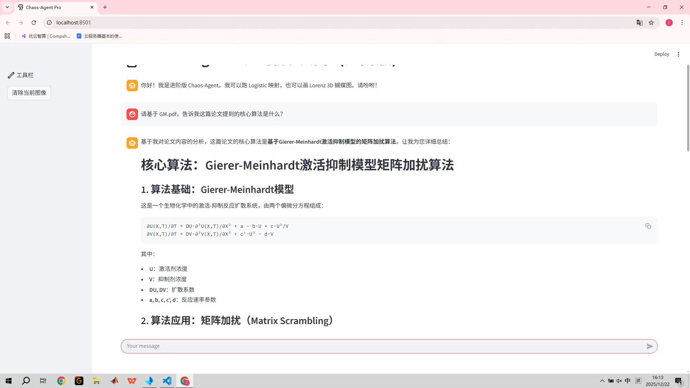

# 📅 [2025.12.22] 学习笔记：[leetcode刷题以及RAG优化]
## 🎯 学习目标
- [x] 做了leetcode的环形链表II，合并两个有序链表
- [x] 成功实现了agent的RAG增强搜索
## 📝 核心知识点 (Key Takeaways)
### 1.环形链表II
与昨天环形链表一样，我们需要一个快慢指针，这里快慢指针写法和昨天环形链表完全一样，目的是判断这个链表是否是环形，找到环形后，我们不需要记录严格的数学推导公式，just remember 判断有环后，将一个指针移到表头，另一个指针不变，俩个指针沿着链表继续走，他们再次相遇时，就是pos处
``` python
# Definition for singly-linked list.
# class ListNode(object):
#     def __init__(self, x):
#         self.val = x
#         self.next = None

class Solution(object):
    def detectCycle(self, head):
        """
        :type head: ListNode
        :rtype: ListNode
        """
        # 1. 【初始化指针】
        slow = head
        fast = head
        # 2. 【第一阶段：判断是否有环】
        # 经典的龟兔赛跑
        while fast and fast.next:
            slow = slow.next
            fast = fast.next.next
            # 如果相遇了，说明有环，进入第二阶段
            if fast == slow:
                # 3. 【第二阶段：找环入口】
                # 根据数学推导：a = c
                # 我们派一只新乌龟从头开始走，老乌龟从相遇点继续走
                # 为了省内存，直接复用 fast 指针，把它扔回起点
                fast = head
                while slow != fast:
                    fast = fast.next
                    slow = slow.next
                return slow
                # 4. 【没有环】
        # 如果退出了第一个 while 循环，说明跑到了尽头，没有环
        return None
```
### 2.合并俩个有序链表
注意是有序，所以这个问题其实就是比大小加拉拉链，我们需要三个指针，最主要是维护curr，不需要创建一个新的链表，只需要改变链表指针指向就可，具体代码如下
``` python
# Definition for singly-linked list.
# class ListNode(object):
#     def __init__(self, val=0, next=None):
#         self.val = val
#         self.next = next
class Solution(object):
    def mergeTwoLists(self, list1, list2):
        """
        :type list1: Optional[ListNode]
        :type list2: Optional[ListNode]
        :rtype: Optional[ListNode]
        """
        # 1. 【哨兵节点/哑节点】
        # 创建一个虚拟头节点，作为新链表的“锚点”
        # 它的值不重要，最后我们返回 dummy.next 即可
        dummy = ListNode(-1)
        # 2. 【移动指针】
        # cur 用来在后面不断地“穿针引线
        cur = dummy
        # 3. 【核心循环：比大小】
        # 只要两条链表都还有节点，就继续比
        while list1 and list2:
            # 如果 list1 小，就把 list1 接到 cur 后面
            if list1.val <= list2.val:
                cur.next = list1
                # list1 指针后移
                list1 = list1.next
            else:
                # 如果 list2 小，就把 list2 接到 cur 后面
                cur.next = list2
                #list2指针后移
                list2 = list2.next
            # 无论接了谁，cur 都要走到新链表的末尾，准备接下一个
            cur = cur.next
            # 4. 【收尾工作】
        # 循环结束时，肯定有一条链表空了，另一条可能还有剩
        # 因为剩下的部分本来就是有序的，直接全部接过去就行
        if list1:
            cur.next = list1
        elif list2:
            cur.next = list2
        # 5. 【返回结果】
        # 返回哑节点的下一个节点，才是真正的合并后的头 
        return dummy.next
```
### 3.agent进展
今天加入了RAG检索，将自己的研一发表的论文放置在根目录下，agent能够正确读到并且总结，RAG的本质，其实就是为了防止模型遗忘设置的“分块提取”然后储存为数字的列向量，放在缓存区中，有空我得去看一看RAG的源码，至此，AGENT将在明天收尾后告一段落，接下来是更加深入的transformers＋hugging face的LoRA微调技术，预计在圣诞节开始着手这个部分。

# to ❀
我不行了，又被导师压榨干杂活，我感觉我自己要tm鼠掉了
