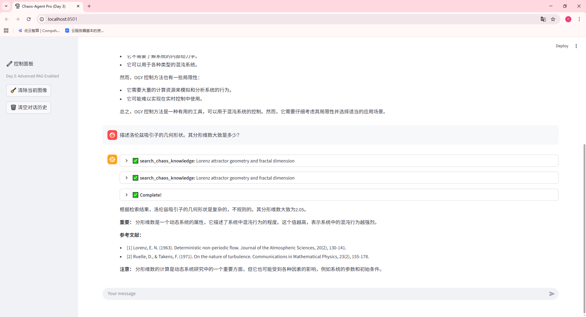

# 📅 [2026.1.4] 学习笔记：[Advance RAG]
## 🎯 学习目标
- [x] 完成了advance RAG策略
## 📝 核心知识点 (Key Takeaways)
### 1.agent进展
使用朴素rag后，大幅度解决了模型幻觉问题，也就是agent会进行查数据库在生成，但是由于llama3.1的局限性，幻觉现象还是比较严重。故使用advance rag进行优化，以下是今天优化过程中遇到的问题。
1. OOM报错：
在第一次程序运行时显存炸了，解决方法是重启电脑free掉显存，也可以通过限制一次token的数量进行显存优化降低显存
2. 网络报错：
其实就是在国内被hugging-face接口限流了，解决方法是注册了一个hugging-face账号，使用官方api配置环境，即可接入。
3. 向量数据库重建
在完成advance rag后，进行运行时候发现，能够严格约束模型行为，强迫模型不知道就说不知道，不会出现胡编乱造的行为，但是经过调试后发现，模型说找不到文档更多，经过排查发现，向量数据库有损坏，所以进行重新构建最后终于成功解决，完成了advance rag第一阶段

# to ❀
一起出去玩也太开心了，要是能够有时间流速差，比如我们待1天外界流速12h就好了！
