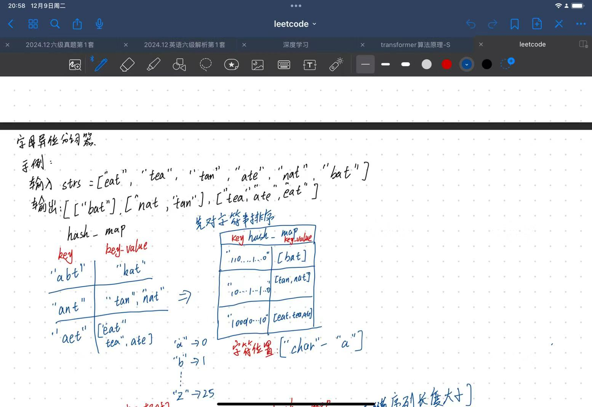
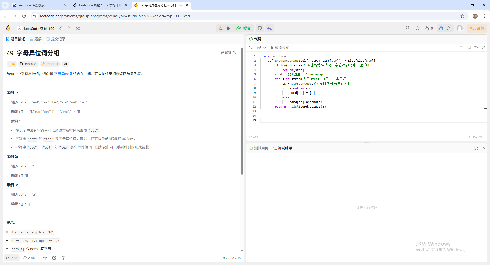
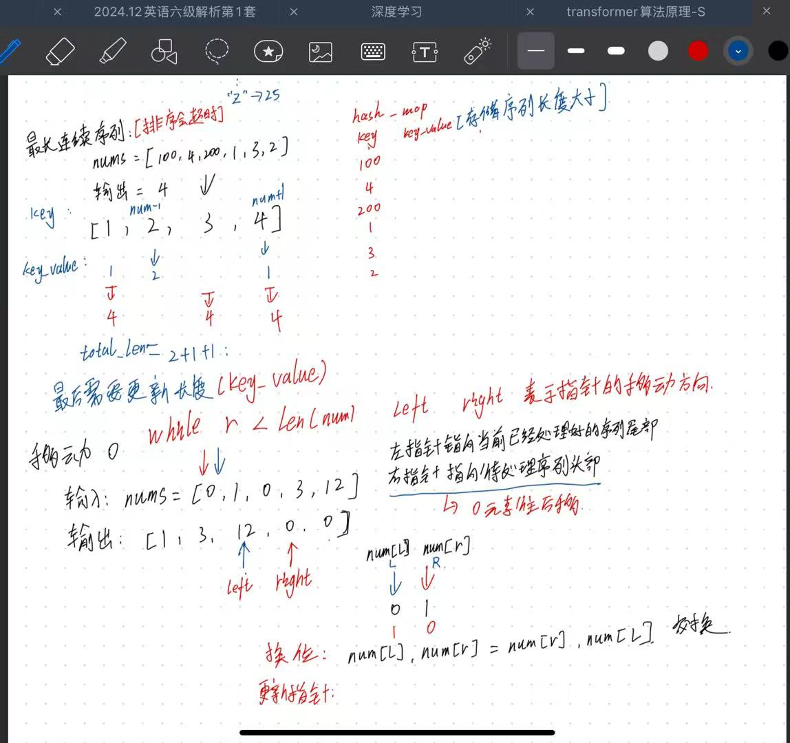
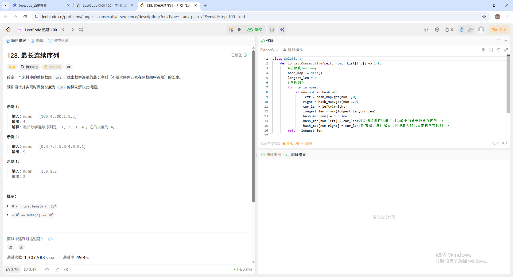
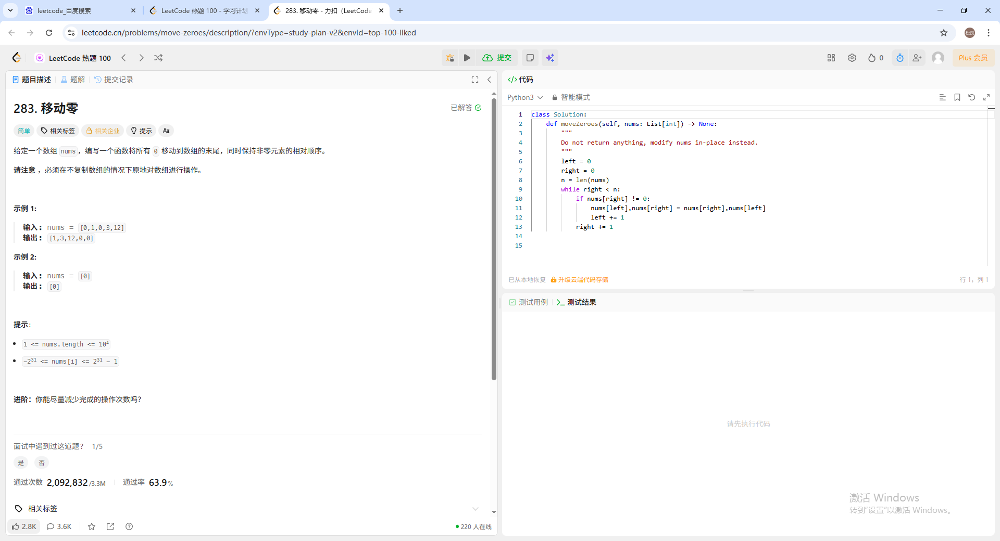

# 📅 2025-12-09 学习日志

## 🎯 今日目标

- [x] 完成leetcode三道题目
- [x] 对transform数据进行预处理，并且生成了数据查看器、提取器、以及解密器。
## 📝 学习内容
1. 字母异位词分组
解题思路：本质上来说是hashmap的应用，将排序后str存入hashmap中的key。也就是“aet”，遍历str中的值，出现相同字母即加入到hashmap中的key—value也就是“eat”“ate”
思考步骤为：

其中题目要求与代码提交为

2. 最长连续序列
同样考察hashmap，这里hashmap存放的key依然是元素的大小，但是key-value存放的是目前为止连续序列的长度。需要注意的是排序完后需要及时更新长度，也就是key_value的值，并且更新完当前的长度值后，也要把两端的值key-value的值更新为当前长度值
思考步骤为：

其中题目要求与代码提交为

3. 移动0
解题思路，本质上来说是双指针的应用，搞清楚指针指向位置以及即使更新指针即可，将非0数往前移动，将0往后移（测试用例中已经排好序）
思考步骤为：

其中题目要求与代码提交为

4. 对transformer的数据进行了预处理，从获取语料数据，提取语料数据形成训练文件夹，其代码为
```python
import json

path = "../data/json/train.json"  # 你的这段文件
with open(path, "r", encoding="utf-8") as f:
    data = json.load(f)  # 自动把 \uXXXX 还原

# 看前两条，ensure_ascii=False 用于“打印中文”
print(json.dumps(data[:3], ensure_ascii=False, indent=2)) #打印前三行的数据

# data 的结构应当是：[[en, zh], [en, zh], ...]
print(type(data), len(data), type(data[0]), len(data[0]))


#读取json文件中的句式，其实给定的是构建词表的方法，及是[英文，中文]
5. 构建数据集
```python
import json  # 导入json模块，用于处理JSON格式的数据

if __name__ == "__main__":  # 主程序入口，当脚本被直接执行时运行
    files = ['train', 'dev', 'test']  # 定义文件列表，包含训练集、开发集和测试集
    ch_path = 'corpus.ch'  # 中文语料库文件路径
    en_path = 'corpus.en'  # 英文语料库文件路径
    ch_lines = []  # 用于存储中文句子的列表
    en_lines = []  # 用于存储英文句子的列表

    for file in files:  # 遍历文件列表
        # 加载JSON格式的语料文件，使用utf-8编码
        corpus = json.load(open('./json/' + file + '.json', 'r', encoding="utf-8"))
        # 遍历语料中的每一项，提取英文和中文句子
        for item in corpus:
            en_lines.append(item[0] + '\n')  # 将英文句子添加到列表，并添加换行符
            ch_lines.append(item[1] + '\n')  # 将中文句子添加到列表，并添加换行符

    # 将中文句子写入文件
    with open(ch_path, "w", encoding="utf-8") as fch:
        fch.writelines(ch_lines)  # 一次性写入所有中文句子

    # 将英文句子写入文件
    with open(en_path, "w", encoding="utf-8") as fen:
        fen.writelines(en_lines)  # 一次性写入所有英文句子

    # 输出中文句子的行数
    # lines of Chinese: 252777
    print("lines of Chinese: ", len(ch_lines))
    # 输出英文句子的行数
    # lines of English: 252777
    print("lines of English: ", len(en_lines))
    # 输出完成提示信息
    print("-------- Get Corpus ! --------")
6.对数据集进行分析以及验证数据集是否存在
```python
import os


def analyze_corpus(ch_path, en_path):
    """
    分析双语语料库文件的详细信息
    Args:
        ch_path: 中文文件路径
        en_path: 英文文件路径
    """
    # 检查文件是否存在
    if not os.path.exists(ch_path):
        print(f"中文文件不存在: {ch_path}")
        return
    if not os.path.exists(en_path):
        print(f"英文文件不存在: {en_path}")
        return

    # 获取文件大小
    ch_size = os.path.getsize(ch_path)
    en_size = os.path.getsize(en_path)

    # 读取文件内容并统计行数
    with open(ch_path, 'r', encoding='utf-8') as f:
        ch_lines = f.readlines()
    with open(en_path, 'r', encoding='utf-8') as f:
        en_lines = f.readlines()

    # 计算字符数（不包括换行符）
    ch_chars = sum(len(line.strip()) for line in ch_lines)
    en_chars = sum(len(line.strip()) for line in en_lines)

    # 打印统计信息
    print("=" * 50)
    print("语料库统计信息")
    print("=" * 50)
    print(f"\n中文文件 ({ch_path}):")
    print(f"  文件大小: {ch_size / 1024 / 1024:.2f} MB")
    print(f"  总行数: {len(ch_lines):,}")
    print(f"  总字符数: {ch_chars:,}")
    print(f"  平均每行字符数: {ch_chars / len(ch_lines):.1f}")

    print(f"\n英文文件 ({en_path}):")
    print(f"  文件大小: {en_size / 1024 / 1024:.2f} MB")
    print(f"  总行数: {len(en_lines):,}")
    print(f"  总字符数: {en_chars:,}")
    print(f"  平均每行字符数: {en_chars / len(en_lines):.1f}")

    # 验证中英文行数是否匹配
    if len(ch_lines) == len(en_lines):
        print("\n✓ 中英文文件行数匹配")
    else:
        print("\n✗ 警告：中英文文件行数不匹配！")

    print("=" * 50)


if __name__ == "__main__":
    ch_path = 'corpus.ch'
    en_path = 'corpus.en'
    analyze_corpus(ch_path, en_path)
>明天继续leetcode刷三道题
>继续实现transformer的tokenizer分词器结构
