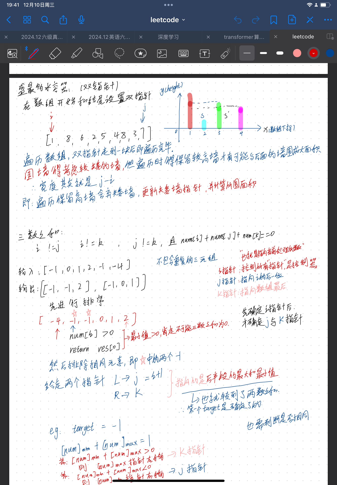
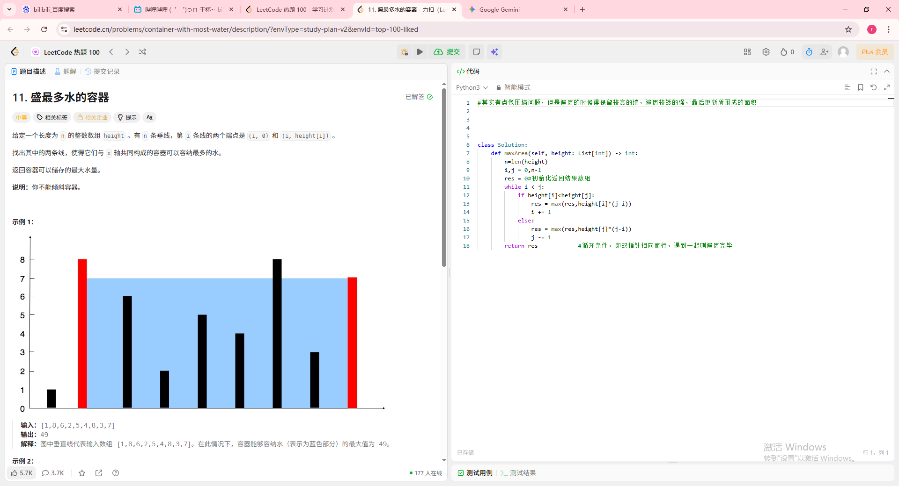
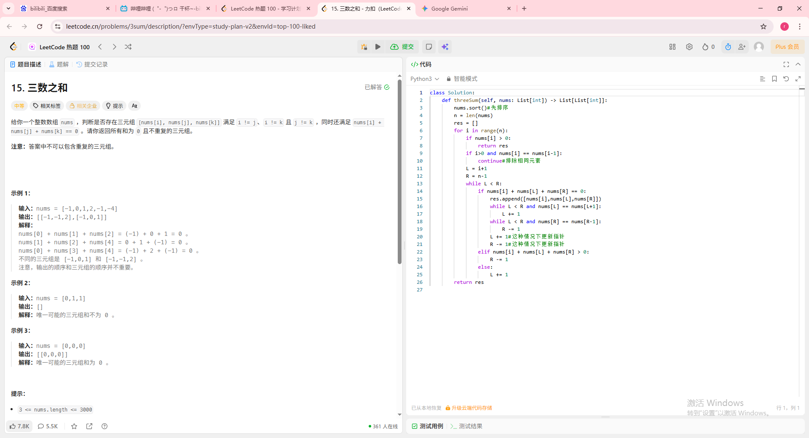
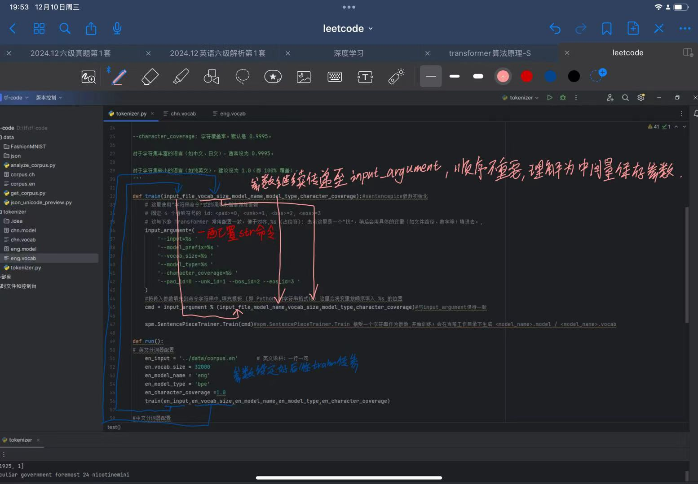
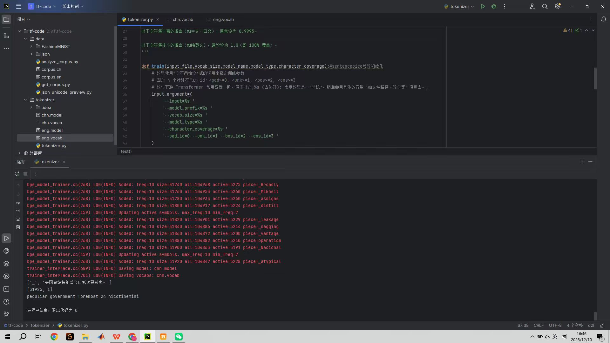

# 📅 [2025.12.10] 学习笔记：[leetcode刷题以及transfomer中tokenizer的编写]
## 🎯 学习目标
- [x] 做了leetcode的三数之和以及盛最多水的容器
- [x] 实现了transformer架构中的分词器
## 📝 核心知识点 (Key Takeaways)
### 1. [leetcode：盛最多的水]
核心思想是双指针，一个从nums数组头一个从nums数组尾相向而行，二者遇到后即遍历完整个数组。
* 值得注意的是，在实现过程中需要将较高的height留下，移动较小的height部分，即可找到能盛最多雨水的俩个元素。

### 2. [leetcode：三数之和代码]
还是双指针的题目，但是需要注意的是，我们这里要定一个能够遍历整个数组的指针i，然后在定义左指针j指向i的后一位，右指针k指向数组尾端，不断更新三个指针状态直至完全遍历
* 数组中可能会出现重复的元素，我们需要跳过这些重复的元素才行。

### 3. [transformer：tokenizer]
今天实现了tokenizer也就是分词器的代码实现，比较不懂的过程其实是一个传参过程，但是后面想通了，其实是引入了一个中间变量来存储所定义的数值。相当于实现了如下图所示的transform粉色部分。

对应的传递参数手写过程如下

模型的效果如下，成功实现了对句子的分词，并且在查询对应编号时返回对应的单词

# 🧠 总结与反思 (Reflection)
*今天完成的不错，但是还是希望最近尽快复现transformer模型，争取在下周开始进入项目+leetcode的编写
# to 🌸
🌻🌷🌿老是害怕时间不够用qaq，今天看到好多放在马乾桌子上的开题报告全是我现在学的这些的，心里面那个悔啊，悔当初没找好导师和好方向，感觉🍐好大
