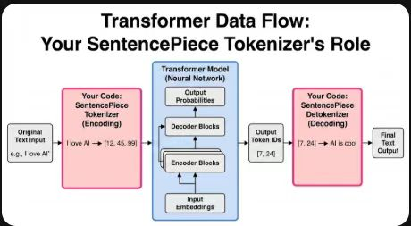

# 📅 [2025.12.10] 学习笔记：[leetcode刷题以及transfomer中tokenizer的编写]
## 🎯 学习目标
- [x] 做了leetcode的三数之和以及盛最多水的容器
- [x] 实现了transformer架构中的分词器
## 📝 核心知识点 (Key Takeaways)
### 1. [leetcode：盛最多的水]
核心思想是双指针，一个从nums数组头一个从nums数组尾相向而行，二者遇到后即遍历完整个数组。
* 值得注意的是，在实现过程中需要将较高的height留下，移动较小的height部分，即可找到能盛最多雨水的俩个元素。


### 2. [leetcode：三数之和代码]
还是双指针的题目，但是需要注意的是，我们这里要定一个能够遍历整个数组的指针i，然后在定义左指针j指向i的后一位，右指针k指向数组尾端，不断更新三个指针状态直至完全遍历
* 数组中可能会出现重复的元素，我们需要跳过这些重复的元素才行。


### 3. [transformer：tokenizer]
今天实现了tokenizer也就是分词器的代码实现，比较不懂的过程其实是一个传参过程，但是后面想通了，其实是引入了一个中间变量来存储所定义的数值。相当于实现了如下图所示的transform粉色部分。



左侧粉色框 (Encoding): 这就是你刚刚调试通过的代码！

输入: 原始文本（如 "I love AI"）。

你的工作: 使用你训练好的 SentencePiece 模型，将文本转换成机器能懂的数字序列（Token IDs，如 [12, 45, 99]）。这是模型的大门。

中间蓝色框 (Transformer Model):

这就是你接下来要学习和复现的 Transformer 神经网络核心（Input Embeddings, Encoder, Decoder 等）。

它接收你传给它的数字序列，进行复杂的计算，最后输出预测的数字序列。

右侧粉色框 (Decoding):

当 Transformer 输出预测结果（如 [7, 24]）时，还需要你的 SentencePiece 把它“翻译”回人类能看的文本（如 "AI is cool"）。这就是 Detokenizer（反分词器）。
对应的传递参数手写过程如下

模型的效果如下，成功实现了对句子的分词，并且在查询对应编号时返回对应的单词

# 🧠 总结与反思 (Reflection)
*今天完成的不错，但是还是希望最近尽快复现transformer模型，争取在下周开始进入项目+leetcode的编写
# to 🌸
🌻🌷🌿老是害怕时间不够用qaq，今天看到好多放在马乾桌子上的开题报告全是我现在学的这些的，心里面那个悔啊，悔当初没找好导师和好方向，感觉🍐好大

``` python
#transformer分词器实现：

import sentencepiece as spm#导入sentencepiece库：用于无监督训练字词（BPE/Unigram）模型以及后续编码/解码
'''
 重要说明（官方参数文档可查）：
    https://github.com/google/sentencepiece/blob/master/doc/options.md

    对sentencepice的官方文档解读，一些参数的填写
--input: (必填) 输入文件的路径。可以是一个文件，也可以是逗号分隔的多个文件列表。

--input_format: 输入文件的格式。默认为空（自动检测），通常支持 text（纯文本，一行一句）或 tsv。

--model_prefix: (必填) 输出模型的前缀名。比如设置为 m，训练完成后会生成 m.model (模型文件) 和 m.vocab (词表文件)。

--vocab_size: 词表大小。默认是 8000。这是决定模型大小的关键参数，BERT 通常是 30k 左右，Llama 是 32k 左右。
2. 模型算法与架构 (Model Architecture)
--model_type: 分词算法类型。默认是 unigram。

unigram: 默认算法，通常效果最好，支持概率分词。

bpe: Byte-Pair Encoding（字节对编码），GPT 系列常用。

word: 仅按词切分（前提是输入已经分好词）。

char: 按字符切分。

--character_coverage: 字符覆盖率。默认是 0.9995。

对于字符集丰富的语言（如中文、日文），通常设为 0.9995。

对于字符集较小的语言（如纯英文），建议设为 1.0（即 100% 覆盖）。
'''

def train(input_file,vocab_size,model_name,model_type,character_coverage):#sentencepice参数初始化
    # 这里使用“字符串命令”式的调用来指定训练参数
    # 固定 4 个特殊符号的 id：<pad>=0, <unk>=1, <bos>=2, <eos>=3
    # 这与下游 Transformer 常用配置一致，便于对齐,%s (占位符): 表示这里是一个“坑”，稍后会用具体的变量（如文件路径、数字等）填进去。,
    input_argument=(
        '--input=%s '
        '--model_prefix=%s '
        '--vocab_size=%s '
        '--model_type=%s '
        '--character_coverage=%s '
        '--pad_id=0 --unk_id=1 --bos_id=2 --eos_id=3 '
    )
    #将传入参数填充到命令字符串中,填充模板 (即 Python 的字符串格式化) 这里会将变量按顺序填入 %s 的位置
    cmd = input_argument % (input_file,model_name,vocab_size,model_type,character_coverage)#与input_argument保持一致

    spm.SentencePieceTrainer.Train(cmd)#spm.SentencePieceTrainer.Train 接受一个字符串作为参数,开始训练；会在当前工作目录下生成 <model_name>.model / <model_name>.vocab

def run():
# 英文分词器配置
    en_input = '../data/corpus.en'      # 英文语料：一行一句
    en_vocab_size = 32000
    en_model_name = 'eng'
    en_model_type = 'bpe'
    en_character_coverage =1.0
    train(en_input,en_vocab_size,en_model_name,en_model_type,en_character_coverage)

#中文分词器配置
    cn_input = '../data/corpus.en'      # 英文语料：一行一句
    cn_vocab_size = 32000
    cn_model_name = 'chn'
    cn_model_type = 'bpe'
    cn_character_coverage = 0.9995
    train(cn_input,cn_vocab_size,cn_model_name,cn_model_type,cn_character_coverage)

def test():#定义测试用例
    sp = spm.SentencePieceProcessor()
    text = "美国总统特朗普今日抵达夏威夷。"
    sp.Load("./chn.model")
    #编码为字词片段,字符串如[_美国,_总统]这样的字词片段
    print(sp.EncodeAsPieces(text))
    #编码为id整数序列
    print(sp.EncodeAsIds(text))

    #示例 给定一串ID返回解码文本
    a = [12907, 277, 7419, 7318, 18384, 28724]
    # 注意：Python API 的方法名是 CamelCase：DecodeIds / DecodePieces
    print(sp.DecodeIds(a))

if __name__ == "__main__":
    run()
    test()
