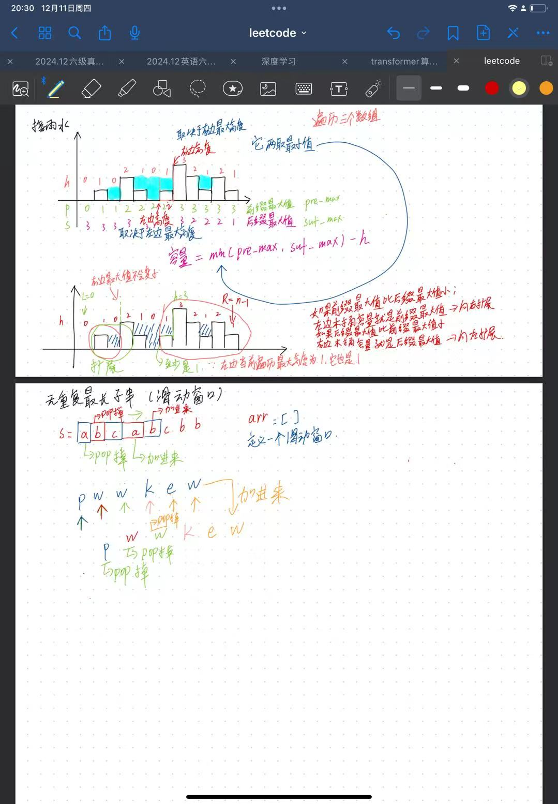
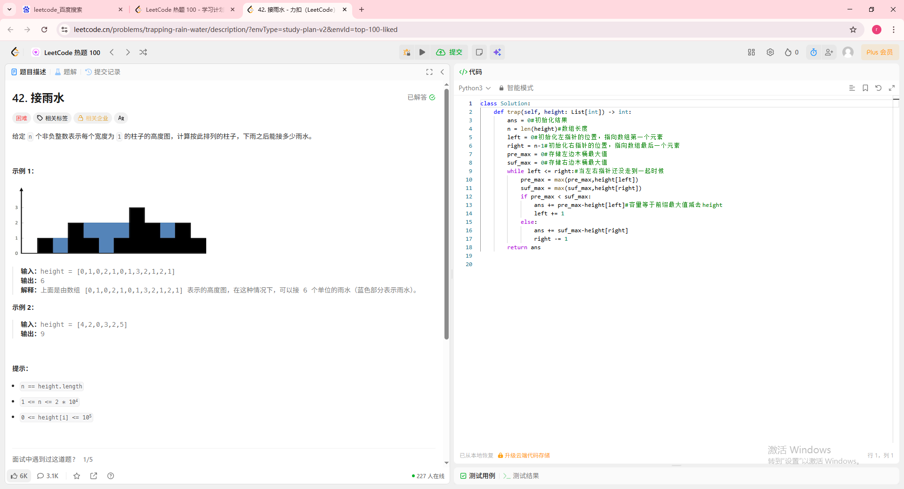
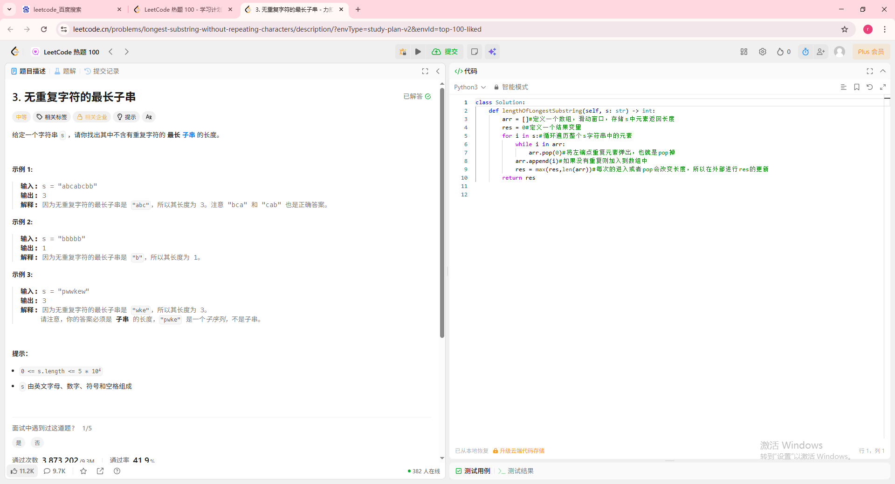
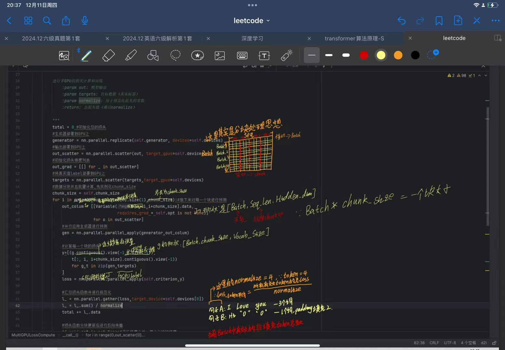

# 📅 [2025.12.11] 学习笔记：[leetcode刷题以及transfomer中损失函数和反向传播的编写]
## 🎯 学习目标
- [x] 做了leetcode的接雨水和无重复最长字串
- [x] 实现了transformer架构中的损失函数和反向传播的编写
## 📝 核心知识点 (Key Takeaways)
### 1. [leetcode：接雨水]
其实本质上来说是双指针，对比左边木板和右边木板谁高，用height-矮的就是能接多少雨水，思考过程如下图所示

题目及代码如图所示：

### 2. [leetcode：无重复最长字串]
本质上来说是滑动窗口，慢慢变长，遇到重复的将左端点pop出去，然后判断是否符合加入窗口的条件，最后返回窗口内所有元素，思考过程如下

题目及代码如图所示：

### 3. [transformer：损失函数与反向传播]
主要是理解分块思想，比如说我传的batch是一个batch_size=128，seq = 240的一个batch，我分块后，我把batch_size拆成一个个小的batch比如说16，然后再把一个seq拆成10个为一组，形成一个块，最后做全部累加即可得到所有loss值，常用于显示器内存不足的情况。
代码手写注解如图所示：

# 🧠 总结与反思 (Reflection)
*今天遇到难题了，就是分块的思想，主要是搞懂张量的格式，并且要会用一些python的语法
# to 🌸
🌻🌷🌿花花今天直接就是一整个大不舒服（水逆），希望明天花花能够快点好起来，我们一起去看雪！当然如果特别难受的话也要和我说我和你去医院嗷，no down！keep high）bushi
