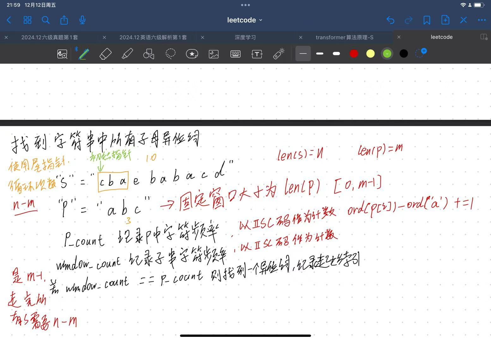
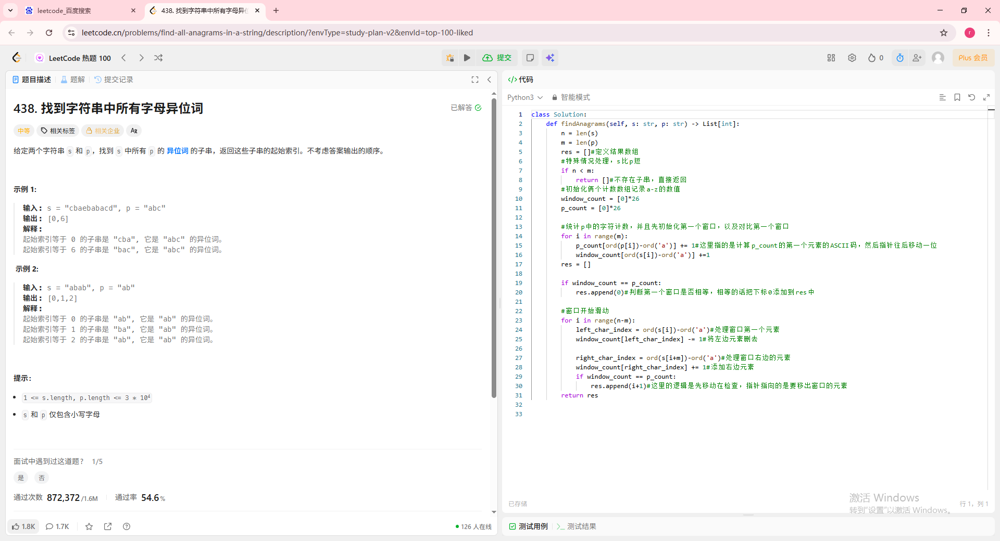
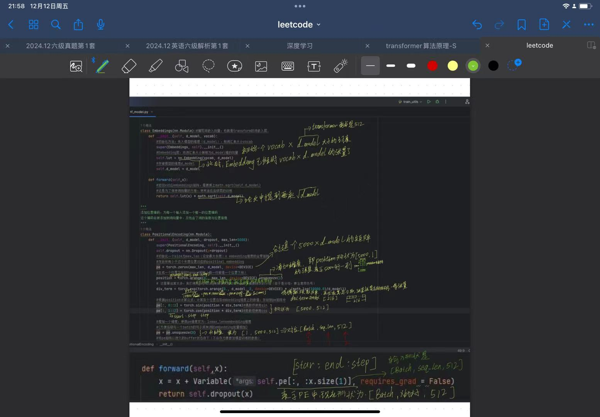

# 📅 [2025.12.11] 学习笔记：[leetcode刷题以及transfomer中损失函数和反向传播的编写]
## 🎯 学习目标
- [x] 做了leetcode的字符串中所有字母异位词
- [x] 实现了transformer架构中的词嵌入向量与位置编码
## 📝 核心知识点 (Key Takeaways)
### 1. [leetcode：字符串中所有的字母异位词]
主要是考察滑动窗口，与之前不同的是，给定了滑动窗口的长度，用窗口内的字母ASCII与目标ASCII做对比即可，因为不考虑顺序，所以窗口内数字相同即可
思考过程如下图所示：

题目以及代码如图所示：

### 2. [transfomer：词嵌入向量与位置编码]
主要掌握了pytorch的一些语法，以及深入理解了张量（Tensor）与矩阵的差别，不要用矩阵的思维去考虑张量是什么样的

# 🧠 总结与反思 (Reflection)
*别用矩阵的思维去思考张量，用矩阵思维思考会把自己给绕进去
# to 🌸
🌻🌷🌿喜欢和你玩雪！好玩！爱玩！还一起给我们的娃拍拍！开心！
