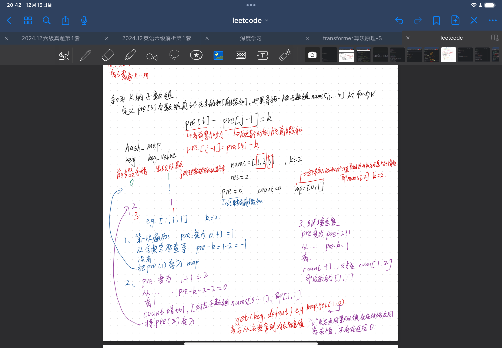
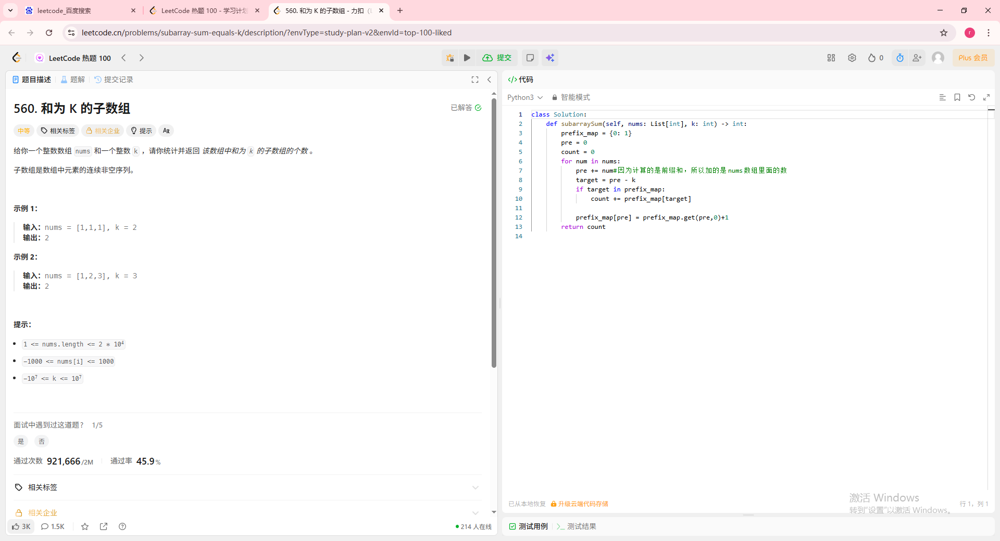
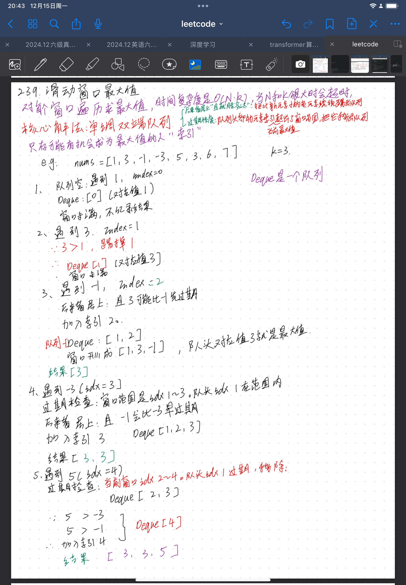
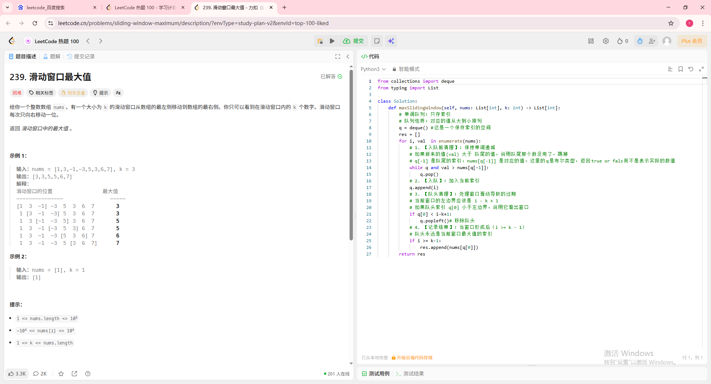
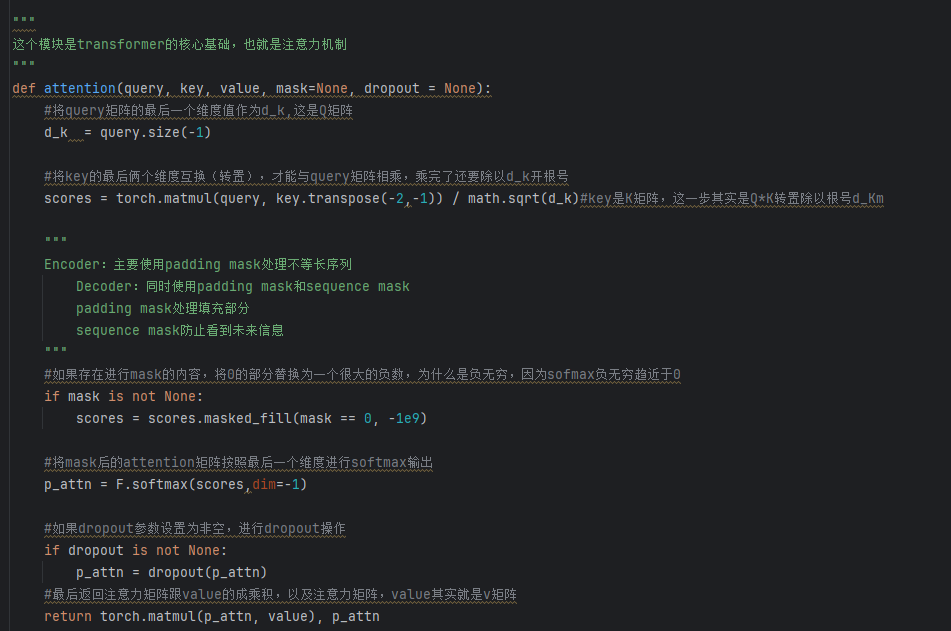
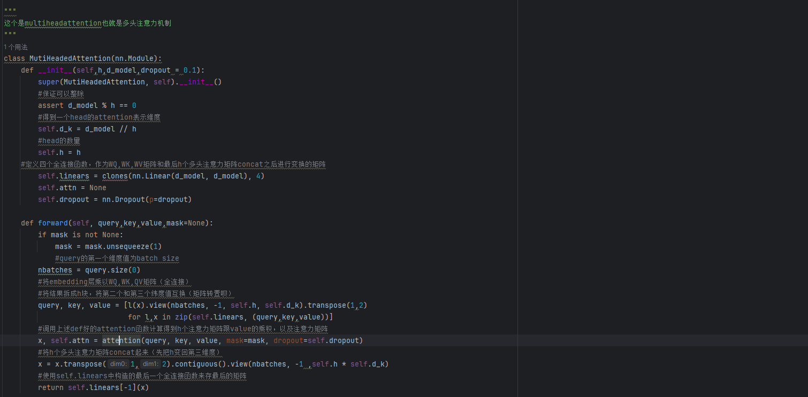

# 📅 [2025.12.11] 学习笔记：[leetcode刷题以及transfomer中损失函数和反向传播的编写]
## 🎯 学习目标
- [x] 做了leetcode的合为k的子数组和滑动窗口最大值
- [x] 实现了transformer架构中的注意力机制以及多头注意力机制
## 📝 核心知识点 (Key Takeaways)
### 1. [leetcode：合为k的子数组]
现在看到类似题目已经有了大概的解题思路，就比如这道题，一开始就想到了用hash map去解题，但是对怎么解不是很了解，其实就是算前缀和，具体可见我的思考过程，思考过程如下图所示：

对应的解题过程如图所示：

### 2. [leetcode：滑动窗口最大值]
这里与之前的滑动窗口不一样，这里需要维护一个队列，窗口不用维护，题目自己走，队列是第一次接触，但是我觉得解题思路非常巧妙，概括为优胜劣汰，后来居上，具体思考过程如下图所示：

对应的解题过程如图所示

### 3. [transformer：注意力与多头注意力]
今天复现了注意力与多头注意力，多头注意力需要注意的是如何去理解多头，通俗点就是将例如512个维度包含的信息假设拆成8个头，每个头就是64，所关注度不同，比如说头1关注语法，头2关注感情，头3关注balabala这样，拆分后算出对应的qkv后在拼成一块，拼的操作是concat就好了
具体代码及注释如图所示：

# to 🌸
🌻🌷🌿太好了！明天终于可以浅浅出逃一下去外面学习一下了这样子，换换地方，但是我感觉我读研究生真的好痛苦啊啊啊啊啊
