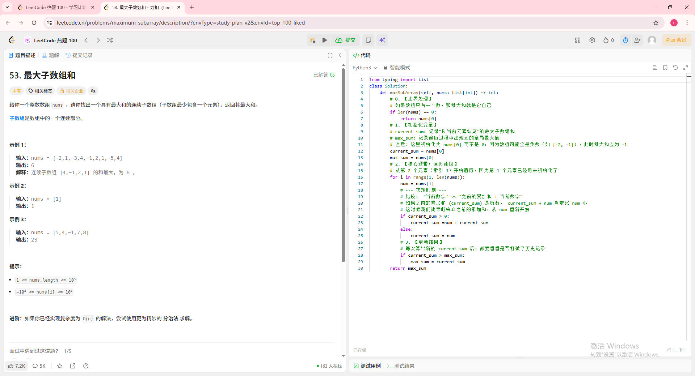
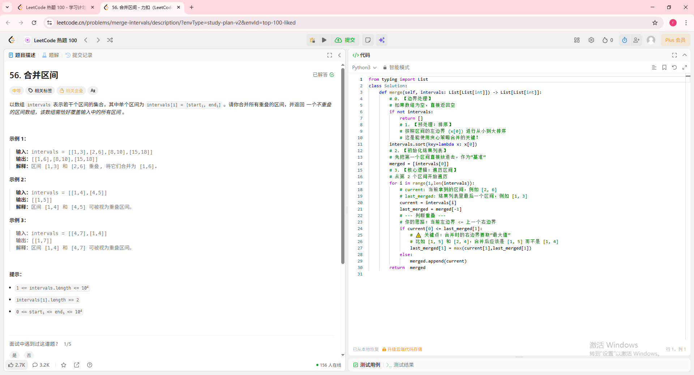

# 📅 [2025.12.11] 学习笔记：[leetcode刷题以及transfomer中损失函数和反向传播的编写]
## 🎯 学习目标
- [x] 做了leetcode的合并区间，最大子数组合，以及最小覆盖字串（这个属于是hard题目）代码和思考过程太长了，我准备下次在贴上来
- [x] 完整实现了transformer，慢慢消化一下python的写法以及pytorch架构
## 📝 核心知识点 (Key Takeaways)
### 1. [leetcode：最大子数组和]
贪心算法，属于中等题目，只需要判断当前current_num与num的大小就行，也就是说是单打独斗划算还是最后带着累赘合适，最后输出max_num即可：

### 2. [leetcode：合并区间]
这个主要是我们需要创建一个res存储合并后的数组，判断数组是否能合并是非常好想的，图片如下所示：

### 3. [transformer]
今天实现了transfomer的全模型实现，加深理解了pytorch的架构，也就是class def forward的写法，明天应该能抽个时间把模型给训练出来，然后准备开始准备自己的项目
# to 🌸
🌻🌷🌿有花花陪着就是学得快，有花花贴就是好！但是好倒霉明天要干那个傻逼调研，我真的无语了
